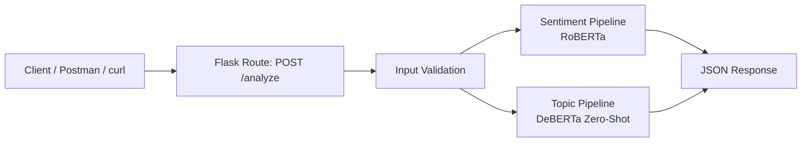

# Flask Feedback Analysis API

[](https://www.python.org/downloads/)
[](LICENSE)
[](https://flask.palletsprojects.com/)
[](https://huggingface.co/docs/transformers/)
[](https://pytorch.org/)
[](https://www.docker.com/)

> A Flask API for user feedback analysis that classifies sentiment and detects product-related topics using Hugging Face transformer models.

## Table of Contents
- [Overview](#overview)
- [Features](#features)
- [Architecture](#architecture)
- [Technology Stack](#technology-stack)
- [Project Structure](#project-structure)
- [Getting Started](#getting-started)
  - [Prerequisites](#prerequisites)
  - [Installation](#installation)
  - [Running Locally](#running-locally)
  - [Running with Docker](#running-with-docker)
- [Usage](#usage)
- [API Reference](#api-reference)
- [Validation Rules](#validation-rules)
- [License](#license)

## Overview
**Flask Feedback Analysis API** receives a user comment through a REST endpoint and returns two kinds of analysis:

- **Sentiment classification** using `cardiffnlp/twitter-roberta-base-sentiment-latest`
- **Topic classification** using `MoritzLaurer/deberta-v3-large-zeroshot-v2.0`

The project is intentionally small and focused: one endpoint, local model inference, JSON responses, and a Docker image for deployment.

### Key Capabilities
- **Sentiment Detection**: Classifies text into sentiment labels returned by the RoBERTa sentiment model
- **Zero-Shot Topic Classification**: Maps comments to predefined product feedback topics without task-specific training
- **REST API Delivery**: Exposes the analysis through a simple Flask endpoint
- **Containerized Runtime**: Ships with a Dockerfile for reproducible execution
- **Input Validation**: Rejects empty, numeric-only, symbol-only, or repeated-character inputs

## Features
- **Single-purpose endpoint**: `POST /analyze` for fast API integration
- **Multi-label topic inference**: Returns one or more topics above the confidence threshold
- **Structured JSON responses**: Easy to consume from frontend apps, Postman, or other services
- **Graceful error handling**: Returns validation and runtime errors as JSON
- **Logging enabled**: Tracks processed texts, results, and processing time

## Architecture


## Technology Stack
| Component | Technology | Purpose |
|-----------|-----------|---------|
| **Web API** | Flask 3.0.3 | HTTP routing and JSON responses |
| **Sentiment Model** | `cardiffnlp/twitter-roberta-base-sentiment-latest` | Sentiment classification |
| **Topic Model** | `MoritzLaurer/deberta-v3-large-zeroshot-v2.0` | Zero-shot topic classification |
| **ML Framework** | Transformers 4.41.2 | Model loading and inference pipelines |
| **Tensor Backend** | PyTorch 2.0.0 | Model execution |
| **Numerical Support** | NumPy 1.26.4 | Runtime dependency |
| **Containerization** | Docker + Gunicorn | Packaging and serving the API |

## Project Structure
```bash
flask-docker-llm-sentiment-topic-api/
├── app/
│   ├── __init__.py                     # Flask app factory and logging setup
│   ├── feedback_analysis_service.py    # Validation, sentiment, and topic analysis
│   └── routes.py                       # API route definitions
├── Dockerfile                          # Container image definition
├── LICENSE                             # MIT license text
├── requirements.txt                    # Python dependencies
└── README.md                           # Project documentation
```

## Getting Started
### Prerequisites
- **Python**: 3.9 or higher
- **pip**: For installing dependencies
- **Docker**: Optional, for containerized execution
- **Internet access on first run**: Required so Hugging Face models can be downloaded and cached

### Installation
1. **Clone the repository**
```bash
git clone https://github.com/your-username/flask-docker-llm-sentiment-topic-api.git
cd flask-docker-llm-sentiment-topic-api
```

2. **Create and activate a virtual environment**
```bash
python -m venv .venv

# Linux / macOS
source .venv/bin/activate

# Windows
.venv\Scripts\activate
```

3. **Install dependencies**
```bash
pip install -r requirements.txt
```

### Running Locally
Start the Flask application with:

```bash
flask --app app:create_app run --host=0.0.0.0 --port=5000
```

The API will be available at [http://127.0.0.1:5000](http://127.0.0.1:5000).

### Running with Docker
Build and run the container:

```bash
docker build -t flask-feedback-analysis-api .
docker run -p 5000:5000 flask-feedback-analysis-api
```

The container uses Gunicorn and exposes the API on port `5000`.

## Usage
Send a `POST` request to `/analyze` with a JSON body containing `comment`.

### Example Request
```bash
curl -X POST http://127.0.0.1:5000/analyze \
  -H "Content-Type: application/json" \
  -d '{"comment":"The app is easy to use, but performance is still inconsistent."}'
```

### Example Success Response
```json
{
  "sentiment": "neutral",
  "topic": [
    "Performance",
    "Usability"
  ]
}
```

### Example Validation Error
```json
{
  "error": "Invalid input text"
}
```

## API Reference
### `POST /analyze`
Analyzes a user comment and returns sentiment and topic labels.

**Request body**
```json
{
  "comment": "The checkout flow is confusing and too slow."
}
```

**Success response**
- **Status**: `200 OK`
- **Body**:
```json
{
  "sentiment": "negative",
  "topic": [
    "Performance",
    "Usability"
  ]
}
```

**Error responses**
- `412 Precondition Failed`: Missing or invalid comment
- `500 Internal Server Error`: Unexpected processing error

## Validation Rules
The service rejects comments when they are:

- Empty or missing from the request body
- Composed only of digits
- Composed only of symbols
- Too short or made of the same repeated character

For topic classification, only labels with score greater than `0.7` are returned.

## License
This project is distributed under the **MIT License**.

Based on [LICENSE](LICENSE), you are permitted to use, copy, modify, merge, publish, distribute, sublicense, and sell copies of the software, provided that the copyright notice and permission notice are included in substantial portions of the software.

The software is provided **"as is"**, without warranty of any kind, express or implied. For the full license text, see [LICENSE](LICENSE).
